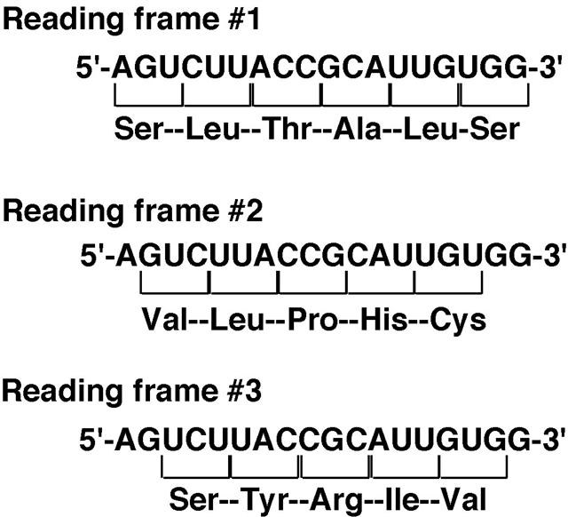

```R
# set image size and resolution
fig <- function(width, heigth, res){
 options(repr.plot.width = width, repr.plot.height = heigth, repr.plot.res = res)
 }
```


```R
fig(5,5,200)
```

# A Brief introduction to R

We can use R console as a calculator


```R
2*6
```

All variables (scalars, vectors, matrices, etc.) created by R are called objects. In R, we assign values to variables using an arrow.


```R
x <- 4+46
```


```R
x
```

There are several possible different types of objects in R, including scalars, vectors, matrices, arrays, data frames, tables, and lists. The scalar variable x above is one example of an R object. While a scalar variable such as x has just one element, a vector consists of several elements. The elements in a vector are all of the same type (eg. numeric or characters), while lists may include elements such as characters as well as numeric quantities.

### Vector

To create a vector, we can use the c() (combine) function.


```R
avector <- c(8, 6, 9, 10, 5)
```


```R
avector
```

### List

In contrast to a vector, a list can contain elements of different types, for example, both numeric and character elements. A list can also include other variables such as a vector. The list() function is used to create a list. For example, we could create a list alist by typing:


```R
alist <- list(husband="Fred", wife="Mary", avector)
alist
```

The elements in a list are numbered, and can be referred to using indices. We can extract an element of a list by typing the list name with the index of the element given in **double square brackets** (in contrast to a vector, where we only use **single square brackets**). Thus, we can extract the second and third elements from `alist` by typing:


```R
# access the second element
alist[[2]]

# access the third element
alist[[3]]
```


```R
# access with element name
alist$name
```


```R
# access element from a vector inside a list
alist[[3]][2]
```

We can find out the names of the named elements in a list by using the `attributes()` function, for example:


```R
attributes(alist)
```

### DataFrame


```R
# For a list of prebuild datasets
library(help = "datasets")
```


```R
PlantGrowth
```


```R
# Create a dataframe

names <- c("Liam", "Noah", "Oliver", "Emma", "Elijah")
data <- data.frame(label=letters[1:5], number=11:15, names )
data
```

### When you need help

**Synopsis**:

`?functionName()`

`help("functionName")`

`help(functionName)`

## Creating our own function

Some useful functions in R:
- `mean()`
- `length()`
- `print()`
- `plot()`

### Let's create our own function

Base count of a sequence:
- A: 3426
- C: 2240
- G: 2770
- T: 2299


```R
# Calculate the total
3426+2240+2770+2299
```

- **Total: 10735**

**Formaula**: GC content = (number of Gs + number of Cs)*100/(genome length)

`Synopsis: FunctionName <- function(variables) {some_codes}`


```R
# Define a function for GC percentage count
gcCount <- function(G,C,length){
    paste("GC content of your seq is : ",round((G+C)*100/(length), 2),"%")
}
```


```R
gcCount(G = 2770,
        C = 2240,
        length = 10375)
```

## for loop

**Syntax:** `for(value in something){statement}`


```R
# An example
for (i in 1:10) { print (i*i) }
```


```R
# looping from vector
avector <- c(2, 9, 16, 25)

for (i in avector) { print (i*i) }
```

## Data Input and Output

### Loading data from a file


```R
# Simply load a comma seperated file
DNase <- read.csv("data/2.DNase_data.csv")
```


```R
DNase
```


```R
# Load a CSV file that doesn't have headers
DNase3 <- read.csv("data/3.DNase_data.csv", header = FALSE)
```


```R
DNase3
```


```R
# Add header file to the dataframe
names(DNase3) <- c("run", "conc.", "density")
DNase3
```


```R
# if you want to add rownames
row.names(DNase3) <- seq(1,176)
DNase3
```

------

The function `read.table()` is a more general function which allows you to set the delimiter, whether or not there are headers, whether strings are set off with quotes, and more.


```R
toothgrowth <- read.table("data/4.ToothGrowth.tsv",
                   header=TRUE,
                   sep="\t"         # use "\t" for tab-delimited files
)

toothgrowth
```

--------

### Load data from Excel files

The R functions read.xlsx() and read.xlsx2() from `xlsx` package can be used to read the contents of an Excel worksheet into an R data.frame.

The difference between these two functions is that :

- `read.xlsx()` preserves the data type. It tries to guess the class type of the variable corresponding to each column in the worksheet. Note that, read.xlsx function is slow for large data sets (worksheet with more than 100 000 cells).
- `read.xlsx2()` is faster on big files compared to `read.xlsx()` function.

The simplified formats of these two functions are:

`read.xlsx(file, sheetIndex, header=TRUE, colClasses=NA)`

`read.xlsx2(file, sheetIndex, header=TRUE, colClasses="character")`


```R
# Load the library
library("xlsx")
```


```R
# Let's read an xlsx file
chikw <- read.xlsx("data/5.chickweight.xlsx", sheetIndex = 1, colClasses=NA)
chikw
```

---------------

### Saving Data as a file


```R
dir.create("data2")
```


```R
# Write to a file, suppress row names
write.csv(DNase, "data/2.DNase_data.csv", row.names=FALSE)
```


```R
ToothGrowth
```

---------

## Plotting


```R
fig(3,4,200)
```


```R
vector1 <- c(10, 15, 22, 35, 43)
vector2 <- c(3, 3.2, 3.9, 4.1, 5.2)
plot(vector1, vector2, xlab="vector1", ylab="vector2")
```


```R
# plot with both line and point
plot(vector1, vector2, xlab="vector1", ylab="vector2", type = "b")
```

## Install Packages in R

> The Comprehensive R Archive Network **(CRAN)** is the official R packages repository

-----------------------

- To install R packages from CRAN repository...

**Syntax: `install.packages("packageName")`**

- To install packages from anaconda..

Syntax: `conda install -c channelName packageName -y`


<font color=red>**NB: This type of code will work on bash kernel/terminal and don't forget to activate your target conda environment.**</font>
 
-------------------------

### Bioconductor

> **Bioconductor** provides tools for the analysis and comprehension of high-throughput genomic data

Bioconductor version 3.8 and later uses BiocManager:

-----------------------
<font color = brown> **To install BiocManager by R code:** </font>


`if (!requireNamespace("BiocManager"))
install.packages("BiocManager")
BiocManager::install()`


<font color = green> **We can also install BiocManager by using conda:** </font>

`conda install -c conda-forge r-biocmanager -y`

-------------------

<font color=darkpink>**Install Packages from Bioconductor**</font>
* By R code: `BiocManager::install("packageName")`


* By conda: `conda install -c channelName packageName -y`

 
----------------------------


For example we will install `biostrings` package by using following code. Copy and paste the code in a bash terminal.

`conda install -c bioconda bioconductor-biostrings -y`

----------------------

# Working with Biological Sequence in R

Let's install <font color = red> **NibBioinfo** </font> package developed by us.


```R
install.packages("package/NibBioinfo_0.1.0.tar.gz", repos = NULL, type = "source")
```

You can i.nstall **"seqinr"** package from conda via bash terminal or from Bioconductor via R code


```R
# Load the libraries
library("seqinr")
library(NibBioinfo)
```

### Retrieving genome sequence data using `SeqinR` package


```R
# download dengue sequence
denguegenome <- getNcbiSeq("NC_001477")
```


```R
denguegenome[1:50]
```


```R
# check the length of the sequence
length(denguegenome)
```


```R
str(denguegenome[1:50])
```

------------

### Writing sequence data out as a FASTA file


```R
write.fasta(names="DEN-1.fa, accession: NC_001477", sequences=denguegenome, file.out="data2/6.den1.fasta")
```

---------------------

### Reading sequence data into R


```R
dengue <- read.fasta(file = "data/6.den1.fasta")
```


```R
dengue
```


```R
length(dengue)
```


```R
str(dengue)
```


```R
# we can not extract subsequence from dengue object
dengue[40:80]
```


```R
# put the sequence into a vector
dengueseq <- dengue[[1]]
```


```R
length(dengueseq)
```


```R
str(dengueseq)
```


```R
# now we can extract subsequence
dengueseq[40:80]
```

----------------------

### Base composition of a DNA sequence


```R
table(dengueseq)
```

---------------------

### GC Content of DNA

GC content = (number of Gs + number of Cs)*100/(genome length)


```R
(2240+2770)*100/(10735)
```


```R
GC(dengueseq)*100
```

------------------

### Local variation in GC content

Local fluctuations in GC content within the genome sequence can provide different interesting information, for example,
- they may reveal cases of horizontal transfer or
- reveal biases in mutation.

**A sliding window analysis of GC content** (Non-overlapping)


```R
?gcSlidingWindowPlot
```


```R
gcSlidingWindowPlot(500, dengueseq, "red")
```

------------------

# Computational Gene Finding


```R
# Required library
library(seqinr)
library(Biostrings)
```


```R
# Load the dengue genome data
dnv <- read.fasta(file = "data/6.den1.fasta")
# put the sequence into a vector
dnvgenome <- dengue[[1]]
```


```R
# change to suitable image size
fig(6,7, 200)

# standard genetic code
tablecode()
```


```R
# changing back to previous image size
fig(5,5,200)
```

## Finding start and stop codons in a DNA sequence


To look for all the potential start and stop codons in a DNA sequence, we need to find all the **“ATG”s, “TGA”s, “TAA”s, and “TAG”s** in the sequence.

To do this, we can use the `matchPattern()` function from the `Biostrings` R package, which identifies all occurrences of a particular motif (eg. “ATG”) in a sequence. As input, the `matchPattern()` function requires that the sequences be in the form of a string of single characters.

-------------

**Let's find start codon (ATG) from a seq segment.**


```R
?matchPattern
```


```R
# A sequence seqment
segment <- "tcaagtaggagtaggagtttttcaagaaggcgtgttccacacaatgtggcacgtcaccaggggagctgtcctcatgtaccaagggaagagactggaaccaagtt"

# Find all ATGs in the sequence dnvseq
matchPattern("atg", segment)
```

------

### Find all potential start and stop codons of a Sequence


```R
?StartsAndStops
```


```R
dengue_segment <- dnvgenome[1:500]
dengue_segment
length(dengue_segment)
```


```R
# Check whether it works or not?
StartsAndStops(dengue_segment)
```


```R
# Convert from vector to string
dnvstring <- c2s(dengue_segment)
dnvstring
length(dnvstring)
```


```R
StartsAndStops(dnvstring)
```

-------------

## Reading Frames

Potential start and stop codons in a DNA sequence can be in three different possible reading frames.



From the output of `StartsAndStops()` for the first 500 nucleotides of the genome of DEN-1 Dengue virus (see above), you can see that there is a potential start codon (ATG) that starts at nucleotide 137, and a potential stop codon (TGA) that starts at nucleotide 141. That is, the potential start codon is from nucleotides 137-139 and the potential stop codon is from nucleotides 141-143. Could the region from nucleotides 137 to 143 possibly be a gene?

> **For a potential start and stop codon to be part of the same gene, they must be in the same reading frame.**

**Let's cut out this segment**


```R
substring(dnvstring,137,143)
```

If we look at the sequence from nucleotides 137-143, “ATGCTGA”, we see that it starts with a potential start codon (ATG) and ends with a potential stop codon (TGA).

However, the ribosome reads the sequence by scanning the codons (triplets) one-by-one from left to right, and when we break up the sequence into codons (triplets) we see that it does not contain an integer (whole) number of triplets: `ATG CTG A`.

This means that even if the ribosome will not recognise the region from 137-143 as a potential gene, as the ATG at nucleotide 137 is not separated from the TGA at nucleotide 141 by an integer number of codons. That is, this ATG and TGA are not in the same reading frame, and so cannot be the start and stop codon of the same gene.

- The potential start codon at nucleotide 137 of the lambdaseqstartstring sequence is in the +2 reading frame, as there is an integer number of triplets, plus one nucleotide, between the start of the sequence and the start of the start codon (ie. triplets 1-3, 4-6, 7-9, 10-12, 13-15, 16-18, 19-21, 22-24, 25-27, 28-30, ..., 133-135, and a single nucleotide 136).

- However, the potential stop codon at nucleotide 141 is the +3 reading frame, as there are two nucleotides plus an integer number of triplets between the start of the sequence and the start of the stop codon (ie. triplets 1-3, 4-6, 7-9, 10-12, 13-15, 16-18, 19-21, 22-24, 25-27, 28-30, 31-33, 34-36, 37-39, 40-42, 43-45, ..., 133-135, 136-138, and two nucleotides 139, 140).

As the potential start codon at nucleotide 137 and the potential stop codon at nucleotide 141 are in different reading frames, they are not separated by an integer number of codons, and therefore cannot be part of the same gene.

### Finding open reading frames on the forward strand of a DNA sequence


```R
# check with dnvstring
findORFsinSeq(dnvstring)
```

--------------


```R
# check the function with "dnvstring"
plotORFsinSeq(dnvstring)
```


```R
fig(6, 5, 200)
```


```R
# let's check with whole dengue genome.

# convert "dnvseq" vector to string
dnvgenome_string <- c2s(dnvgenome)


# plot the ORF positions
plotORFsinSeq(dnvgenome_string)
```

### Predicting the protein sequence for an ORF


```R
# read the sequence as a set
DengueVirus_set <- readDNAStringSet("data/6.den1.fasta")
DengueVirus_set
```


```R
# Convert a StringSet into a single string
DengueVirus <- unlist(DengueVirus_set)
DengueVirus
```

**All steps**


```R
# step:1
# Find ORF poistions
DengueORFs <- findORFsinSeq(DengueVirus)
DengueORFs
```


```R
# step:2
# Take ORFs length > 20
DNVORFs <- subset(DengueORFs, ORFlengths > 75 )
DNVORFs
```


```R
# step:3
# Extract start and stop positions in a separate vector
startposition <- DNVORFs$ORFstarts
stopposition <- DNVORFs$ORFstops
```


```R
# step:4
allORFs <- DNAStringSet(DengueVirus, start = startposition, end = stopposition)
allORFs
```


```R
# step:6
proteins <- translate(allORFs)
proteins
```


```R
#step:7
# Write the protein sequences as a fasta file
writeXStringSet(proteins, "data/Dengue_Proteins.fa")
```

#### Protein sequences from Reverse Complement


```R
# convert to reverse complement sequence
RevComDNV <- reverseComplement(DengueVirus)
RevComDNV
```

**Now repeat the step 1 to 7 to get all possible protein sequences from reverser complement sequence**

------------

# Link for some resources

1. [A Big Book of R](https://www.bigbookofr.com/index.html)
2. [Graphs with ggplot2](http://www.cookbook-r.com/Graphs/)
3. [Cookbook for R](http://www.cookbook-r.com/)
4. [A Huge list of Books for R learning](https://github.com/jl5000/r_ebooks)
