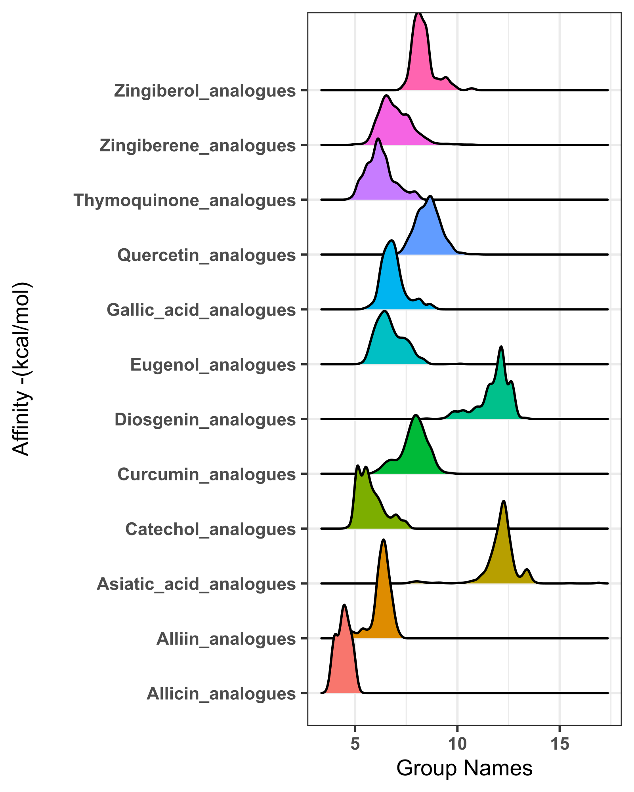

# Save graphs in SVG format
```R
# load library
library(svglite)

svglite("graph-name.svg",
        width =4,
        height =5)
#plot
plot_object_name

dev.off()
```
# Save graphs in PNG format
```R
png(file="graph-name.png",
       width = 3500,
       height = 1400,
       res = 600)
plot_objece_name

dev.off()
```

# Ridgeline Plot
## Basic Ridgeline Plot
```R
options(repr.plot.width = 5,
        repr.plot.height = 5,
        repr.plot.res = 200)

# library
library(ggridges)
library(ggplot2)
 
# Diamonds dataset is provided by R natively
#head(diamonds)
 
# basic example
ggplot(diamonds, aes(x = price, y = cut, fill = cut)) +
    geom_density_ridges() +
    theme_ridges() +
    theme_bw() +
    xlab("Price of the diamonds") +
    ylab("Type of Cut") +
    theme(axis.title.x = element_text(size = 10),
        axis.text.x = element_text(size = 8, face = "bold"),
        axis.title.y = element_text(size = 10),
        axis.text.y = element_text(size = 8, face = "bold"),
        legend.position = "none")
```
**Output**

