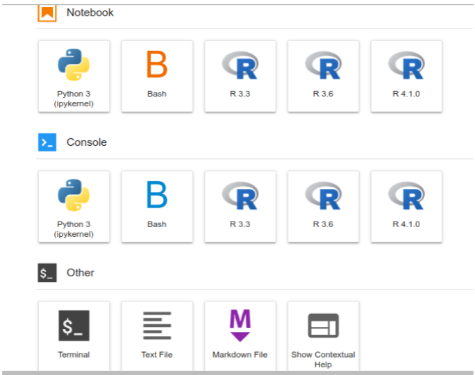
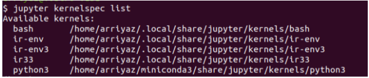
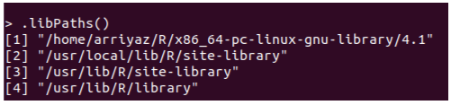

# Install R in `conda` in Linux
## 1. Install necessary dependencies:

```bash
sudo apt-get install libzmq3-dev libcurl4-openssl-dev libssl-dev jupyter-core jupyter-client
````

When you have run this command once. If you create a new conda environment and want to install **IRkernel** for a new R version inside that environment you don’t have to run this command again.


## 2. Install R within a `conda` environment
Create a new R environment and install `r-base` with other necessary & important packages all together

```bash
conda create -y -n r-env r-base r-repr r-irdisplay r-irkernel r-essentials
```

**If your conda contains `mamba` package, install your packages with this command. It is quite faster than native `conda` command.**

```bash
mamba create -y -n r-env r-base r-essentials r-repr r-irdisplay r-irkernel
```

After installing R you may want to run your R codes in jupyter notebooks. In that case, you have to install the R kernel. This kernel will make your R available for jupyter notebook or lab.

Let’s say you install **R version 4.1.2** in the **r-env** environment. So, to make this version of R accessible for jupyter notebook/lab you have to install `IRkernel` in this environment.

You should add `r-essentials` along with `r-base` as it will not only install all the important r packages but also help during **IRkernel** installation.


>> To install a specific R version, let’s say R 4.1.2  
>> `conda create -n r-env3.6 r-essentials r-base==4.1.2`

To know more about installing specific versions of a tool you can see [conda cheat sheet](https://docs.conda.io/projects/conda/en/4.6.0/_downloads/52a95608c49671267e40c689e0bc00ca/conda-cheatsheet.pdf).

## 3. Make kernel available to Jupyter:
Here is the trick. If we install kernelspecs with default names, every time it will replace the previous kernel from a different conda environment.

The aim of creating a conda environment is to manage different versions of tools (in this case different R versions) simultaneously.

So, you have to install different kernels with different names for every version of R. In that case we will be able to run r codes in a different version of R from the jupyter lab/notebook.

**Even we don’t have to activate that particular conda environment to run R inside that environment. We can just run jupyter lab/notebook from conda base and select a particular R kernel.**

**Here, we have installed `R 4.1.0` inside the `r-env` environment**, so for simplicity, we will give the kernel name according to the environment name and displayname of the kernel according to the R version (it is not a specific rule, I am doing this for my ease of use)

### At first, activate the newly created environment.
```bash
conda activate r-env
```

#### Now, run R in the terminal:
```bash
R
```
You will see a typical R console in the terminal. Now we will install our kernel in this console.

```R
IRkernel::installspec(name = 'ir-env', displayname = 'R 4.1.0')
```
> **NB**: Obviously run this command in the R console, not in bash terminal.

After installing the kernel in this way you can access this kernel from the jupyter lab/notebook launcher display. Example of typical launcher display:



>> **NB**: If you install another R version in another conda environment, don’t forget to change the `name` and `displayname` option in the above code.

## 4. Install R packages
Once you install r via conda, you will be able to install packages either by,
```bash
conda install -c channelname r-packagename
```
Or by from R console,
```R
install.packages("PackageName")
```
**NB**: When we use **R** from conda, installing packages by `install.packages("PackageName")` almost always causes problem. So using `conda` is or `mamba` command is better.

-------------
For more details about IRkernel installation, see these three links below:
1. [Developer instruction](https://irkernel.github.io/installation/#linux-panel)
2. [Github link of the IRkernel package](https://github.com/IRkernel/IRkernel)
3. [Man page](https://rdrr.io/github/IRkernel/IRkernel/man/installspec.html)
--------------

# Uninstall a kernel from jupyter
First, activate that specific environment from which you want to remove the kernel
Then run the following code in the terminal
```bash
jupyter kernelspec list
```
You will see available kernel and their paths as below  


To remove a specific kernel, let’s say ir33 from the above image run the following code;
```bash
jupyter kernelspec uninstall ir33
```
Or,
```bash
jupyter kernelspec remove ir33
```

# Removing R from Ubuntu system
By default **Ubuntu** comes with pre-installed R. But, I may causes problem with **R** installed in conda. So it is preferable to completely remove **R** from the **Ubuntu system**.

The following code will remove R that was installed by sudo apt, not by conda.

To remove `core-r`
```bash
sudo apt-get remove r-base-core
sudo apt-get remove r-base
sudo apt-get autoremove
```
But The above code will not remove the installed packages.

To remove all installed packages first run the following code from the terminal, to get the list of folders where all the packages were installed:
```bash
R -e '.libPaths()'
```
The above code will give output as like below:  


Now you have to remove/delete each of the directories by rm command along with the -r flag. For example;
```bash
sudo rm -r /home/arriyaz/R/x86_64-pc-linux-gnu-library/4.1
```
Run such a command for every directory in the list.

**Thus you will completely remove R as well as installed packages from your ubuntu.**


